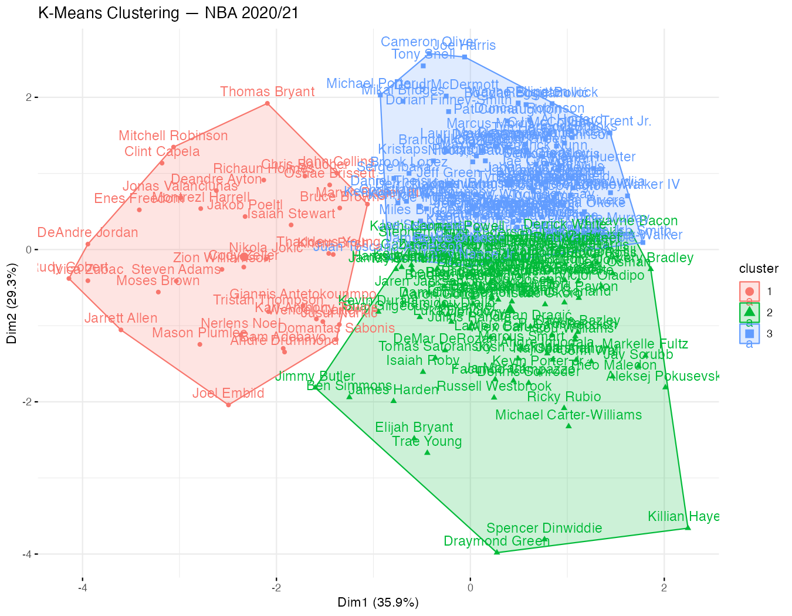
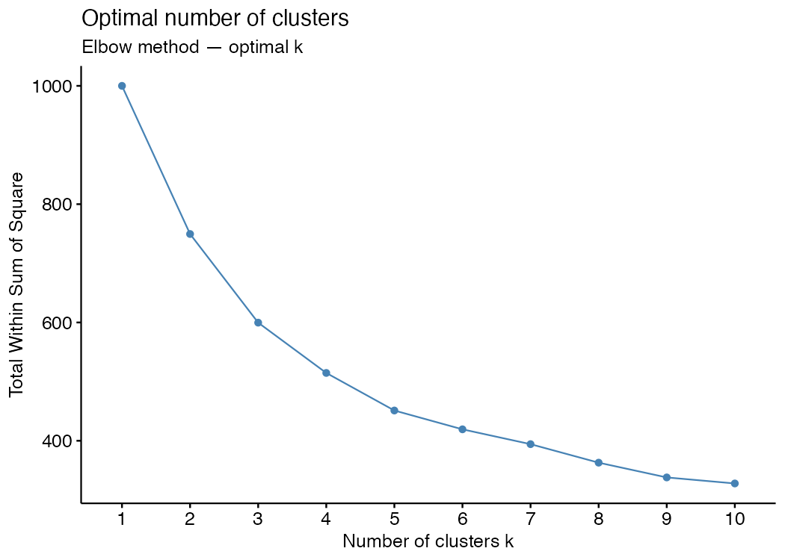

# K-Means Clustering of NBA Player Performance — 2000–2021

A data analysis project in R that explores NBA player performance through physical attribute trends, Oliver's Four Factors breakdown by position, and unsupervised K-Means clustering on the 2020/21 season.

---

## 🖼️ Visuals

### K-Means Cluster Plot — NBA 2020/21


> Three distinct player profiles emerge from the clustering of Oliver's Four Factors (eFG%, TOV%, ORB%, FTr%).

### Elbow Method — Optimal Number of Clusters


---

## 📋 Overview

The project is structured in four stages:

1. **Data cleaning** — handling NA values, unit conversion (ft/inches → cm, lbs → kg), deduplication, and position standardisation.
2. **Physical analysis** — evolution of average height and weight across all NBA seasons (1950–2021), broken down by position.
3. **Four Factors analysis** — comparison of Dean Oliver's four offensive efficiency metrics (eFG%, TOV%, ORB%, FTr%) across the five positions.
4. **K-Means clustering** — unsupervised clustering of 2020/21 players based on the Four Factors, with the optimal number of clusters determined via the Elbow method.

---

## 📂 Repository Structure

```
ClusteringNBAperformance/
├── analysis.R              # Main analysis script
├── R/
│   └── helpers.R           # Utility functions
├── data/
│   ├── seasons_stats.csv   # Season-level player statistics (Kaggle)
│   ├── player_data.csv     # Player biographical data (Kaggle)
│   └── README.md           # Data description and provenance
├── output/
│   └── figures/
│       ├── kmeans_cluster.png
│       ├── elbow_plot.png
│       ├── four_factors.png
│       └── physique_scatter.png
└── docs/
    └── variable_glossary.md
```

---

## 📦 Dependencies

```r
install.packages(c(
  "tidyverse", "ggplot2", "measurements", "factoextra", "GGally"
))
```

---

## 🚀 Reproducing the Analysis

1. Clone the repository:
   ```bash
   git clone https://github.com/marinoalfonso/ClusteringNBAperformance.git
   cd ClusteringNBAperformance
   ```

2. Install dependencies (see above).

3. Run the analysis:
   ```r
   source("analysis.R")
   ```

The script will clean the data, produce all plots, and export figures to `output/figures/`.

---

## 📊 Data Source

Both datasets are sourced from the Kaggle dataset [**NBA Players Stats since 1950**](https://www.kaggle.com/datasets/drgilermo/nba-players-stats) by Gilermo:

| File | Description | Rows |
|---|---|---|
| `seasons_stats.csv` | Season-level player statistics, 1950–2022 | ~24 000 |
| `player_data.csv` | Player biographical data (height, weight, college, etc.) | ~3 900 |

> The datasets are included in this repository for reproducibility. Please refer to the [Kaggle license](https://www.kaggle.com/datasets/drgilermo/nba-players-stats) for terms of use.

---

## 🔑 Key Findings

| Stage | Main Result |
|---|---|
| Physical trends | Average NBA player height has remained stable (~200 cm) since the 1980s; weight has increased slightly, especially among Centres and Power Forwards. |
| Four Factors | Centres lead in ORB% and FTr%; Point Guards lead in eFG% and TOV%. |
| Clustering | 3 clusters emerge: **high-efficiency scorers** (high eFG%, low TOV%), **rebounders/interior players** (high ORB%, high FTr%), and **perimeter / transitional players**. |

---

## 👤 Author

**Alfonso Marino**  
[GitHub](https://github.com/marinoalfonso) · Feel free to open an issue or submit a PR.

---

## 📄 License

This project is licensed under the [MIT License](LICENSE).
